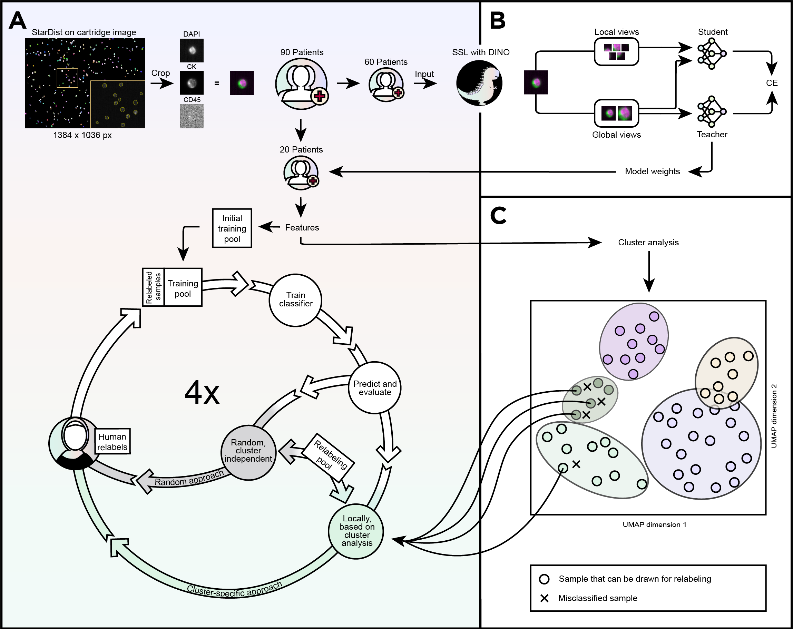
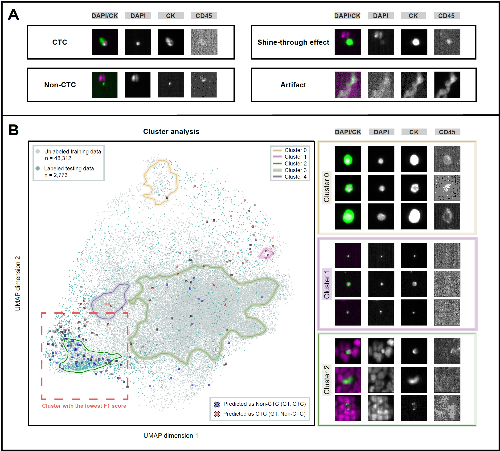
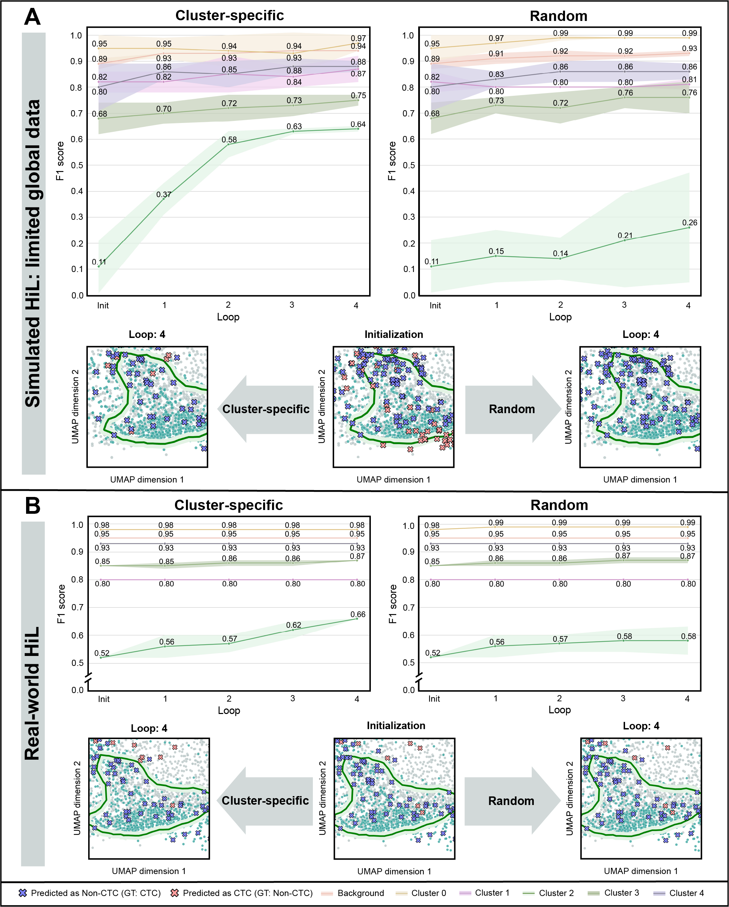
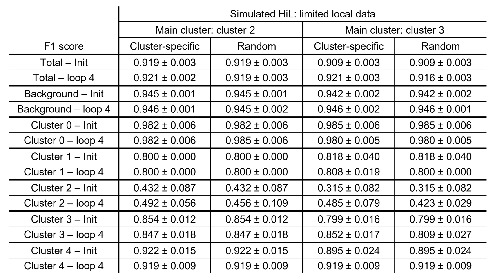

# Cluster-based human-in-the-loop strategy for improving machine learning-based circulating tumor cell detection in liquid biopsy

[](https://doi.org/10.5281/zenodo.15070942)  

This repository contains the official code for the [following paper](https://arxiv.org/abs/2411.16332).

## 🔍 ️ Overview
This study introduces a Human-in-the-Loop (HiL) strategy for improving ML-based classification of circulating tumor cells. 
In a world striving for full automation, you might wonder why human intervention is still needed 🤔. 
The reality is that human expertise 🤓🧠 remains crucial and invaluable, especially when our ML systems face uncertain or incorrect decisions.
In such cases, human input is essential for efficiently generating labeled data to further optimize the ML system predictions, which is a primary motivation for this HiL approach.

✨Our proposal✨:
- **Hybrid Approach:** We combine self-supervised and supervised methodologies and introduce a HiL component to leverage the strengths of each approach. 
- **Focused Iteration**: By iteratively sampling and (re-)labeling (🙋‍♀️: "I can do that!") from areas of high ML uncertainty -identified through cluster analysis- we ensure the system focuses on the most impactful regions for improvement. We call it the *cluster-specific* sampling strategy.
- **Rapid Enhancement**: By providing the ML system with new and relevant training samples, we enable quick and effective classifier adjustments.

The advantages of the cluster-specific approach compared to naive random sampling -where clustering information is not utilized- are demonstrated using liquid biopsy data from patients with metastatic breast cancer.

Here's an overview of the framework and the HiL principle:



🔑Key features of this repository:
- 🌟 **Segmentation Pipeline:** Generate cell images from cartridge images (acquired by the CellSearch® system). We use the [StarDist algorithm](https://github.com/stardist/stardist) for segmentation.
- 🌟 **Self-Supervised Learning:** Example Python script for training on unlabeled liquid biopsy data, based on the work of [Caron et al.](https://arxiv.org/abs/2104.14294) and the reimplementation of DINO from [sparsam](https://github.com/IPMI-ICNS-UKE/sparsam).
- 🌟 **HiL Framework:** Full code for the HiL principle is provided.
- 🌟 **Reproducibility:** Easily reproduce simulation experiments and the clustering plot (Figure 2B).
- 🌟 **Model Weights and Processed Data:** Accessible via [Zenodo](https://doi.org/10.5281/zenodo.14033379).

## 🔧 How to use

### 1. Clone the repository to your local machine

```bash
git clone https://github.com/IPMI-ICNS-UKE/CTC-HiL.git
```

### 2. Set Up Your Environment ⚙️

Create a Conda environment and install the necessary dependencies:

```bash
 conda create --name ctc_hil python=3.8
 conda activate ctc_hil
 cd CTC-hil
 pip install -e .
 pip install -r requirements.txt
```
Tested with Python 3.8 and PyTorch 2.4.1. If you encounter any difficulties related to PyTorch or CUDA, we recommend reinstalling PyTorch following the official [installation guidelines](https://pytorch.org/get-started/locally/).

### 3. Basic usage

```python
import hil
```

The pretrained model is available through [Zenodo](https://doi.org/10.5281/zenodo.14033379).

For custom use, we provide an example Python script [real_hil_example](real_hil_example.py). You can easily adapt this to your own data. An example configuration file is located [here](configs/real_hil_example_cfg.yml).
The blueprint (the general logic) of the HiL principle can be found [here](hil/general_hil_logic.py). 

The specifications of the different experiments (including the simulated HiL experiments - all following the HiL blueprint) are located in the [experiment_setups](experiment_setups) folder. There you can see how each experiment defines its training pool, relabeling pool, cluster-specific sampling strategy, etc. You can also create your own experiment setup as long as you follow the blueprint of the HiL principle.

## ️📊 Reproduce results

Do you want to reproduce the simulation findings and the cluster analysis plot from Figure 2B of our paper? We've got you covered 💪.

### 1. Download data

The processed data can be downloaded via [Zenodo link].

The configuration files of the simulation experiments and of the clustering analysis (to create a plot with cluster contours) are located in the [configs](configs/) folder.
The corresponding main.py files can be found in the [reproducibility](reproducibility/) folder.

Let's get started!

---

#### 🔍 Cluster analysis plot:

1. Start by navigating to the configuration directory. Use [cluster_analysis_cfg.yml](configs/cluster_analysis_cfg.yml)

```bash
cd configs
```

2. Enter the path to your data folder (with files from Zenodo) and specify your results folder. Then return back and generate the cluster plot:

```bash
cd ..
python reproducibility/main_cluster_analysis.py
```

Note: The configuration file contains other settings necessary for the cluster plot, which should be left unchanged if you want to reproduce the results as shown in our paper.

---

#### 🚀 Simulated HiL experiments:

For both Simulated HiL 1 and Simulated HiL 2 experiments, follow these steps:

1. Begin by navigating to the configuration directory. Use [sim_hil_1_cfg.yml](configs/sim_hil_1_cfg.yml) for Simulated HiL 1 and [sim_hil_2_cfg.yml](configs/sim_hil_2_cfg.yml) for Simulated HiL 2:

```bash
cd configs
```

2. Provide the path for both your data folder (containing files from Zenodo) and your results folder. Additionally, specify the sampling strategy you'd like to use ("cluster_specific" or "random"). You also have the option to generate a cluster plot with contours in each loop; however, note that the default setting is false, as enabling it will increase the processing time until the main file completes.
3. For Simulated HiL 2 experiment, you can also specify the main cluster (options: 2 or 3). 

4. Return back and execute the appropriate script:
- For Simulated HiL 1:

```bash
cd ..
python reproducibility/main_sim_hil_1.py
```
   
- For Simulated HiL 2:

```bash
cd ..
python reproducibility/main_sim_hil_2.py
```

Note: The configuration files also contain other necessary settings for both experiments, which should remain unchanged if you want to reproduce the results as shown in our paper.


## 📈 Results

Have a look at the key results from our experiments!

Here, we show the existence of distinct latent space clusters of cells of similar characteristics (shape, size, feature expressions) and observed differing system classification performances for the different clusters. 
Data points not assigned to any of the identified cluster are defined as background. 
The cluster with the lowest F1 score, based on the labeled test data, is highlighted by a red dashed box. Misclassified cells are indicated by crosses. 
The right part of (B) depicts exemplary cell images from clusters 0, 1 and 2.


*Figure 2: Cluster identification and evaluation. Abbreviations and explanations: DAPI: Nuclei stain; CK: Tumor marker; CD45: Leukocyte marker; GT: Ground truth.*

---

**Impact of HiL sampling strategy on classification performance:**

The proposed iterative cluster-specific HiL strategy was compared to a random sampling approach that was independent of cluster associations of newly sampled data points. 
Across all our experiments, encompassing real-world HiL and simulated HiL experiments, we consistently observed a faster increase
in classification accuracy in overall performance as well as in local performance, particularly for the cluster 
initially displaying the lowest F1 score, when employing the cluster-specific approach. 


*Figure 3: (A) Simulated HiL: limited global data). (B) Real-world HiL: Relabeling is performed by a human expert.
Snapshots depict the latent space after initialization and final loop 4, focusing on cluster 2, i.e., 
the cluster with the most misclassifications, highlighting differences in prediction accuracy. 
Abbreviations and explanations: HiL: Human-in-the-loop; Init: Initialization; Loop 1-4: Sampling and relabeling loops.*


**Simulated HiL 2 results:**

Here we show a comparison of the classification performance: cluster-specific vs. random sampling approach for the simulated HiL experiment 2: limited local data. 
When using cluster 2 as the main cluster, the cluster-specific HiL approach achieved a higher F1 score than the random 
sampling method. Similarly, with cluster 3 as the main cluster, the cluster-specific strategy outperformed random sampling, 
both for the main cluster and its neighboring cluster.


---


